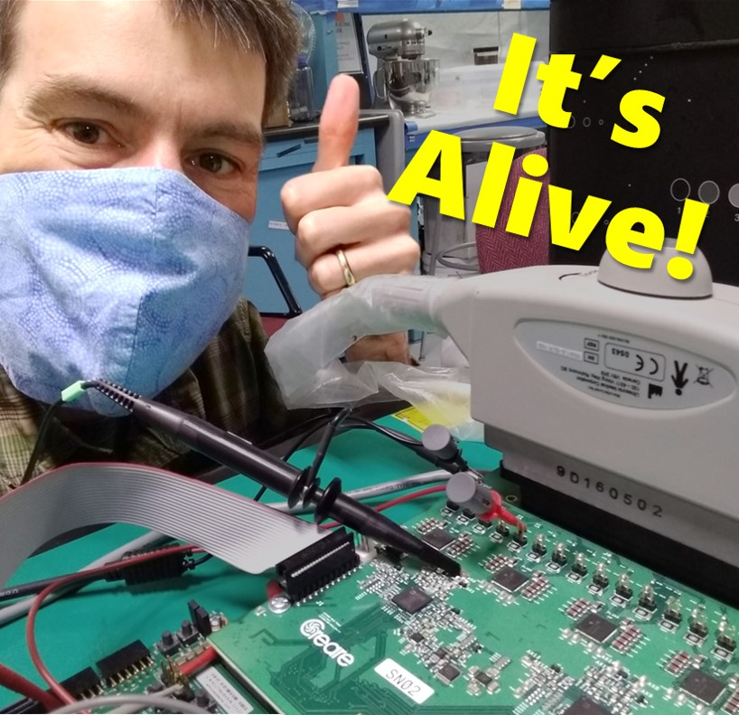
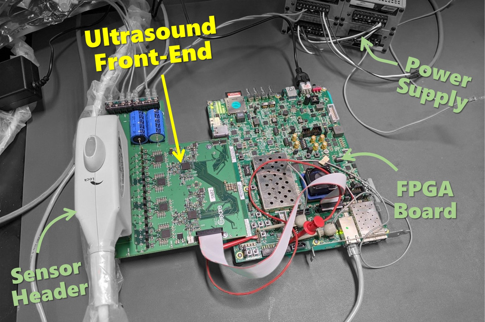
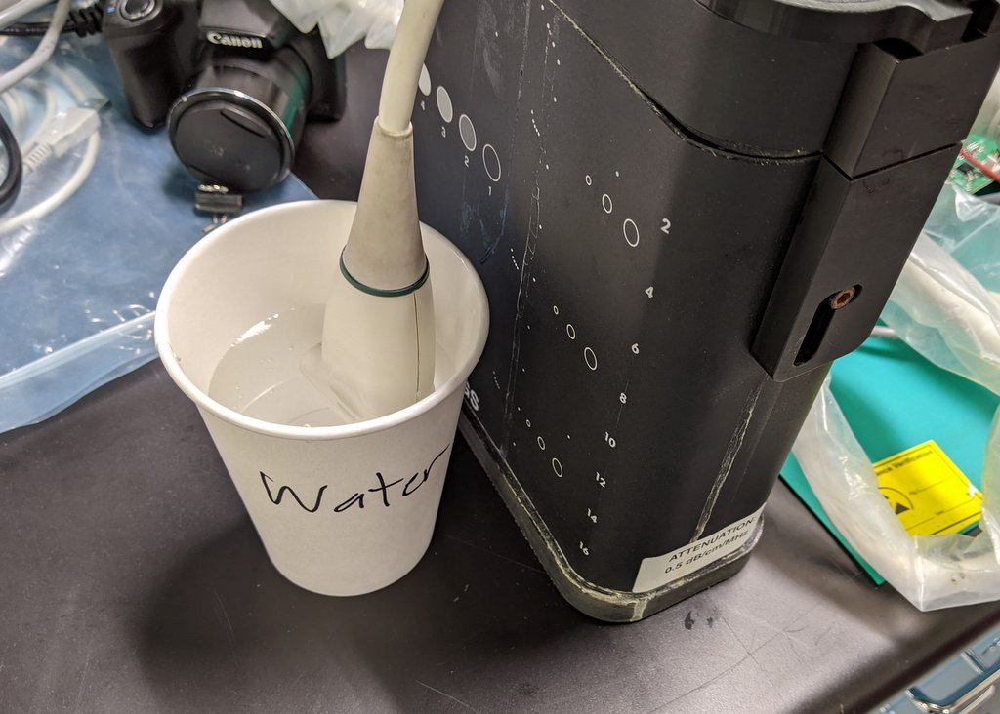
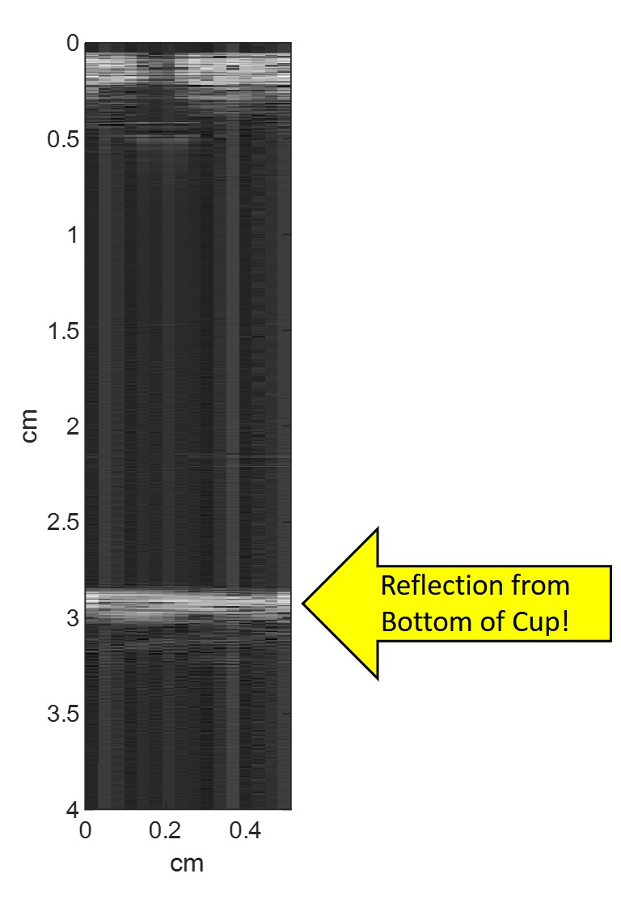

# It's Alive!
October 1, 2020

Success!  Today, we got our open source ultrasound electronics working for the first time.

Below is our current hardware setup.  The ultrasound front-end is the part that we designed and built.  We purchased everything else.  Oh, and we had to write a whole lot of really important code to get the FPGA to drive everything. 

Once we got the the electronics working on the benchtop, it was time for a wet test.  So, we put the ultrasound sensor head into a cup of water.  We used 16 of the elements in the sensor head.

And we got our first image!  We clearly see the reflection off the bottom of the cup.  It's alive!

