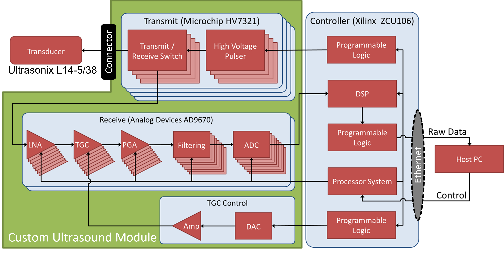

# Imaging Ultrasound Hardware Basics
This document discusses the basic characteristics of the major hardware components of our imaging ultrasound system. The focus of this work is on brightness mode (B-mode) imaging. 

## Example Imaging Ultrasound Hardware Block Diagrams

The figure below shows the core components of an imaging ultrasound system. A multi-element transducer is excited with a high voltage (order 100 Volt) waveform through a transmit / receive (T/R) switch. This voltage causes the transducer element to expand and contract via the [piezoelectric effect](https://en.wikipedia.org/wiki/Piezoelectricity) - launching an ultrasound wave. After firing, the T/R switch flips to the receive pathway. Ultrasound reflections (echos), when they return to the transducer, expand and compress the transducer element, generating a voltage (also via the piezoelectric effect). This voltage is conditioned by an analog front end (AFE). The AFE typically includes multiple gain and filtering stages. Often the gain of one stage will vary with time after triggering; this [time-gain compensation](https://en.wikipedia.org/wiki/Time_gain_compensation) helps counteract losses due to waveform spreading and attenuation. The conditioned signal is then digitized by an [analog to digital converter](https://en.wikipedia.org/wiki/Analog-to-digital_converter) (ADC). A controller regulates the transmit excitation (voltage levels, waveform shape, and chanel-to-channel timing (e.g., for beam focusing)), the receive-side gains and filters, and handles the digitized data stream (possibly including additional signal conditioning and receive-side beam focusing). The controller may also further post-process the data to generate B-mode images. 

The links below show simplified block diagrams of typical medical ultrasound imaging machines. In many ways, our system will look very similar to these:

https://www.analog.com/en/applications/markets/healthcare-pavilion-home/imaging/medical-ultrasound.html

http://www.ti.com/solution/ultrasound-scanner

## Transmit Side
The transmitter excites the ultrasound transducer with high-voltage (order +/- 100 V) waveform. Ideally this is accomplished via, for each channel, a suitable digital to analog converter (DAC) followed by an amplifier with sufficient rails and slew rate. For our initial (Phase I) prototype, we'll use dedicated ultrasound pulser integrated circuits (ICs). These generate what are essentially square waves with user-specified timing and, for some units, level. Examples include:

[Microchip HV7321](http://ww1.microchip.com/downloads/en/DeviceDoc/20005639A.pdf)

[Maxim MAX4940A](https://datasheets.maximintegrated.com/en/ds/MAX4940-MAX4940A.pdf)

[ST STHV800](https://www.st.com/resource/en/data_brief/sthv800.pdf)

These often include integrated transmit/receive switches designed for ultrasound signals, simplifying the overall circuit.

For the Phase I prototype, we have tentatively selected the Microchip HV7321 as it supports five output levels (notionally -1, -1/2, 0, +1/2, and +1), has reasonable output voltages (+/- 80V), has reasonable T/R switch characteristics, and can support continuous wave (CW) operation, and has good nonlinear characteristics (e.g., harmonic distortion during pulse inversion imaging). We have purchased an evaluation board 

## Receive Side

The receive side electronics live downstream of the T/R switch. These electronics typically have a low-noise amplifier (LNA) with programable gain, a time-gain compensation (TGC) element (typically a variable gain attenuator (VGA) or voltage controlled attenuator (VCAT), sometimes followed by a post-amplification stage)(the VGA/VCAT are typically controlled by an external analog voltage, typically generated by a dedicated DAC), anti-aliasing filtering, and analog-to-digital conversion (ADC).  Digitzed data are fed to the processor (microcontroller, FPGA, GPU, etc.) for post-processing. A number of manufacturers make multi-channel analog front end (AFE) integrated circuits specifically for ultrasound processing. Examples include:

[Analog Devices AD9670](https://www.analog.com/media/en/technical-documentation/data-sheets/AD9670.pdf)

[Texas Instruments AFE5812](http://www.ti.com/lit/ds/symlink/afe5812.pdf)

For the Phase I prototype we have tentatively selected the AD9670 as both options are comparable in performance and we have previous experinece with the AD chip (which will save some time on development of the Phase I circuit).

## Controller

The controller is responsible for parsing user-issued commands, configuring the transmit and recieve ICs, and shuttling data to the host PC (possbily via intermediate storage in RAM). Future versions of the system may include embedded processing (e.g. receive-side beamforming, filtering, envelope detection, etc.). For Phase I, all processing of raw received data will take place on the host PC using the software of the user's chosing (e.g. Python, Matlab).  This will greatly simplify the firmware development, bringing it in line with a Phase I scope.

We have tentaviely selected the Xilinx Zynq UltraScale+ XCZU7EV Multi-Processor System on Chip (MPSoc) that features:
+ ARM Cortex-A53 64-bit quad-core processor
+ ARM Cortex-R5F dual-core real-time processor
+ 504k programmable logic cells
+ 1728 DSP slices

ARM processors will handle the user-facing application interface and configuration of the transmit and recieve ICs while the FPGA logic cells will handle the massive amounts of data streamed from the ultrasound AFEs. Available digital signal processing slices may prove useful if we desire simle digital signal conditioning prior to transfer to the host PC.  

To evaluate the MPSoC we have purchased the [ZCU106](https://www.xilinx.com/products/boards-and-kits/zcu106.html) evaluation board that, in addition to the MPSoC, includes:
- USB 2/3
- a PCIe endpoint (up to 8 GT/s) (necessary for real-time ultra-fast plane wave imaging in future efforts)
- 8 GB RAM
- SD card interface
- Gigbit Ethernet
- DisplayPort and HDMI (in case we want to do some visualizations)

# The Open Image System

The figure below shows how we plan to integrate and control the core components described above into the initial Open Image prototype. 

The custom ultrasound module includes four 4-channel pulser ICs and two 8-channel ultrasound analog front end ICs. Below is a rendering of the board.  The module's electrical schematic and printed circuit layout can be found on our [GitHub](https://github.com/open-ultrasound/open-imager/tree/master/Hardware).  See our first [Blog Post](https://www.open-image.org/2020/10/01/its-alive.html) for photographs of the hardware in action!

Want to comment on, edit, or view the history of this document? Visit it on [GitHub](https://github.com/open-ultrasound/open-ultrasound.github.io/edit/master/hardwareIntro.md).
